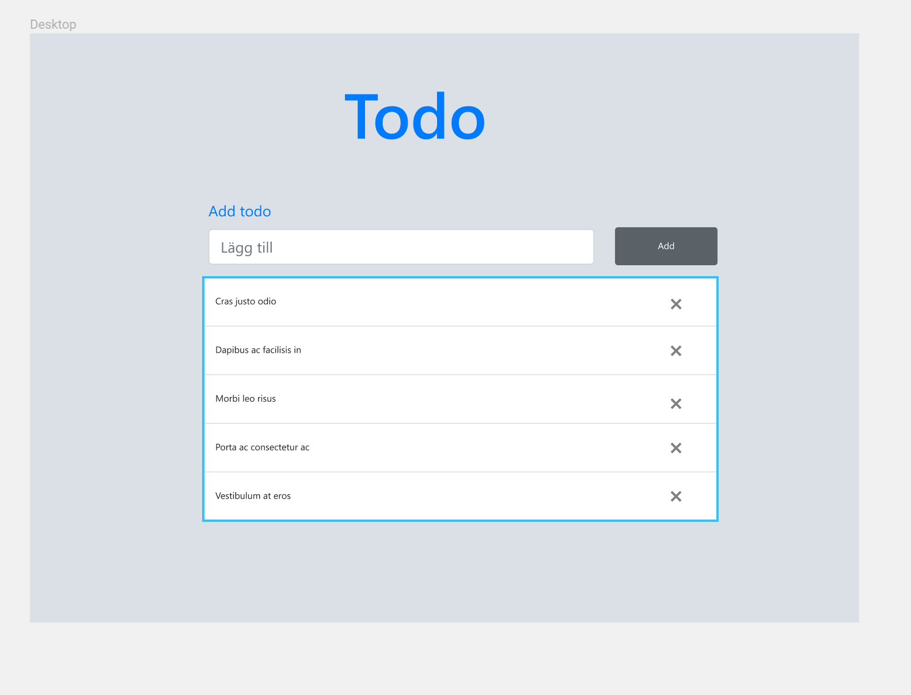

# Build a Todo - App with GraphQL and React

### Requirements

1. The project should have a material design look to it
2. The user should be able to create and delete and task
3. Using Apollo-GraphQL on the client is mandatory.

   

